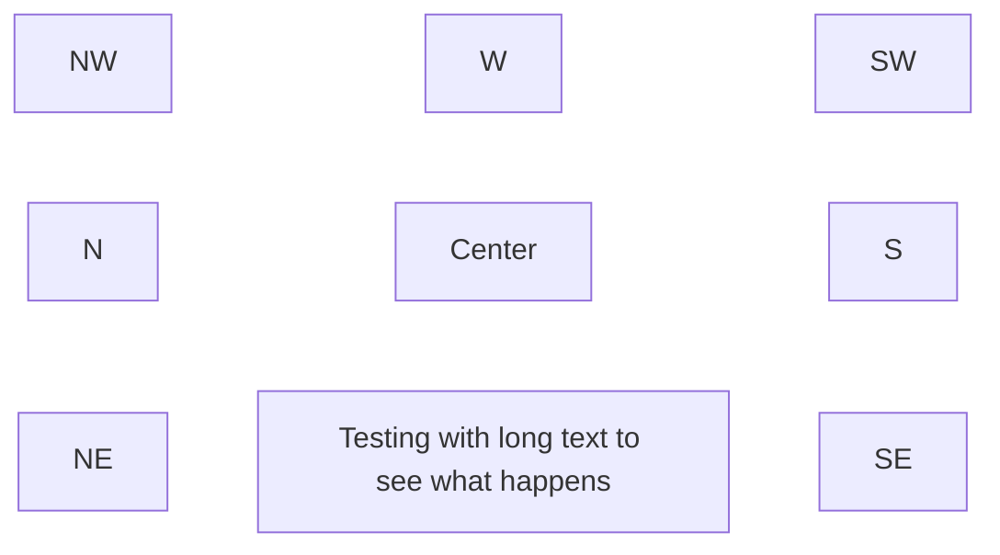

```mermaid
graph TD

    %% Nodes
    NW["NW"]
    N["N"]
    NE["NE"]

    W["W"]
    C["Center"]
    E["Testing with long text to see what happens"]

    SW["SW"]
    S["S"]
    SE["SE"]

    %% Fake links for positioning
    NW --- N --- NE
    W --- C --- E
    SW --- S --- SE

    %% Hide all connectors AND arrowheads
    linkStyle default stroke:transparent,stroke-width:0;
```

