Here is the list of Pie Menus for Blue Hole.

> [!NOTE] Dependencies
> **Note that the Deluxe edition of Blue Hole is required for any Pie Menu shown here.**
> Added dependencies are noted (whenever applicable). The menu would still popup but some option(s) may be missing, with shown warnings.

# 🧊 Object Mode
---
These menus are unique to **Object Mode**.
## 🍰 Tool
Keymap: `Shift + RMB Drag`
Additional dependencies: [HardOPS](https://superhivemarket.com/products/hard-ops--boxcutter-ultimate-bundle).
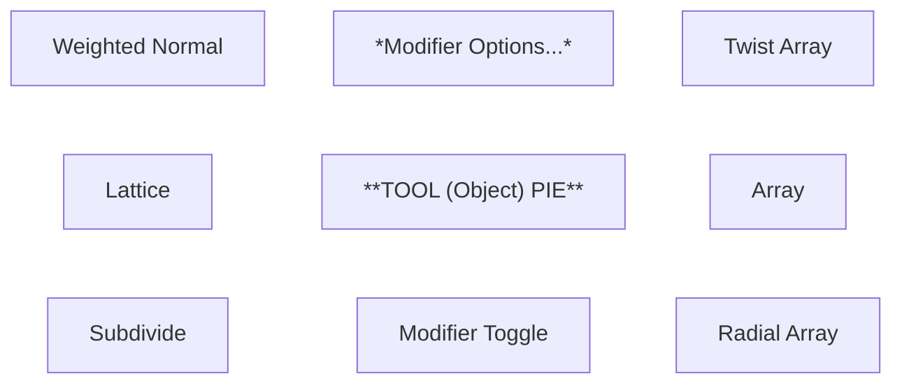
_**Modifier Options** → Link/Transfer Data, Apply Modifiers_

## 🍰 Action
Keymap: `Ctrl + RMB Drag`
Additional dependencies: N/A
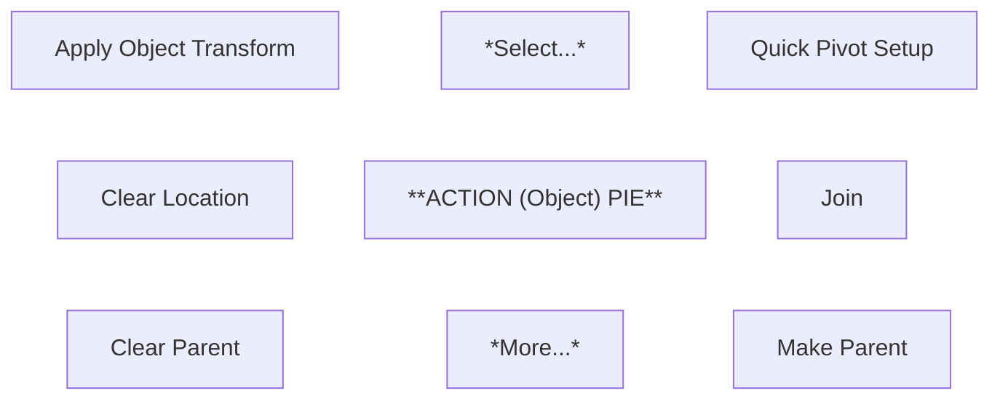
_**Select** → Select Grouped, Select Parent, Invert, Select Children  
**More** → Convert to Mesh, Apply Modifiers, Make Instances Real, Clean, Convert to Curve_

# 🛠️ Edit Mesh Mode
---
These menus are unique to **Mesh Edit Mode**, which corresponds to **Vertex**, **Edge** and **Face** selection.
## 🍰 Tool
Keymap: `Shift + RMB Drag`
Additional dependencies: N/A
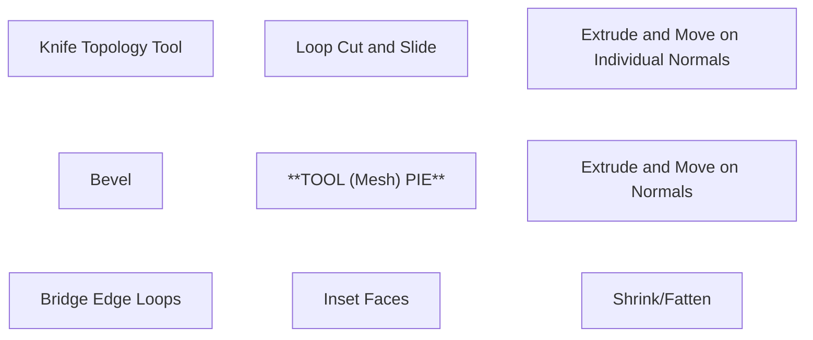

## 🍰 Action (Vertex)
Context: **Vertex Edit Mode**
Keymap: `Ctrl + RMB Drag`
Additional dependencies: N/A
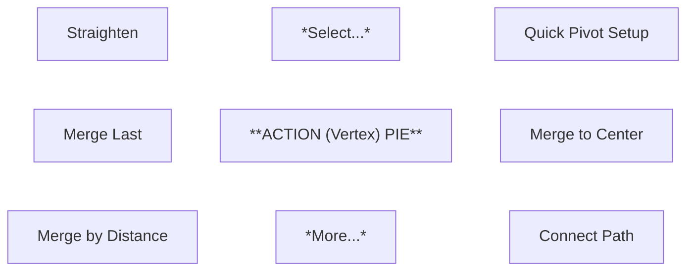
_**Select →**_ _Random, Invert, Loose Geometry_  
_**More →**_ _To Sphere, Symmetrize, Quick Flatten, Vertex to Circle, Quick Lattice_

## 🍰 Action (Edge)
Context: **Edge Edit Mode**
Keymap: `Ctrl + RMB Drag`
Additional dependencies: N/A
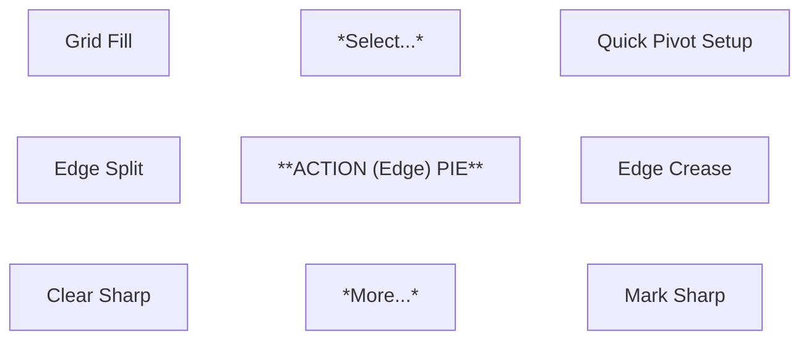
_**Select →**_ _Smart Loop, Sharp Edges, Invert, Smart Ring, Loop Inner-Region_  
_**More →**_ _Subdivide Edge-Ring, Rotate Selected Edge (Right), Quick Pipe, Rotate Selected Edge (Left), Mesh Angle, Collapse_

## 🍰 Action (Face)
Context: **Face Edit Mode**
Keymap: `Ctrl + RMB Drag`
Additional dependencies: N/A
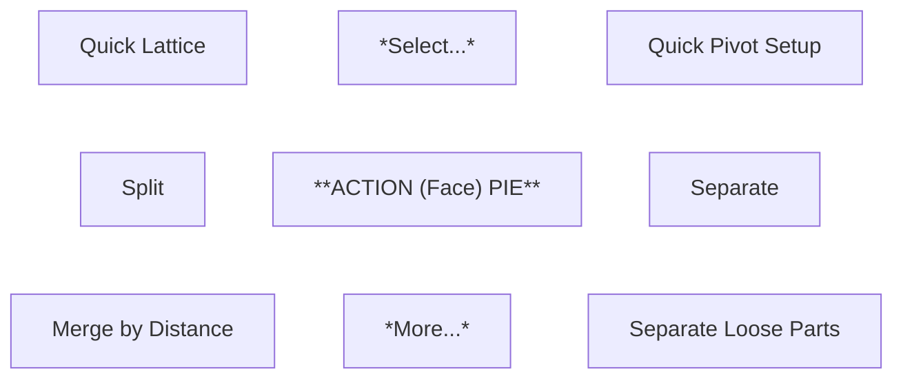
_**Select →**_ _Boundary Loop, Linked Flat Faces, Invert, Loose Geometry, Random_  
_**More →**_ _Poke Face, Recalculate Normals Inside, Recalculate Normals Outside, Subdivide, Tris to Quads, Flip, Triangulate Faces, Un-Subdivide_

## 🍰 Action UV Special (Vertex, Edge, Face)
*This menu has **UV-related** options. It is available from all three **Vertex**, **Edge** and **Face** modes.*
Keymap: `Ctrl + Alt + Shift + RMB Drag`
Additional dependencies: [ZenUV](https://superhivemarket.com/products/zen-uv), [DreamUV](https://github.com/leukbaars/DreamUV)
Additional dependencies: N/A
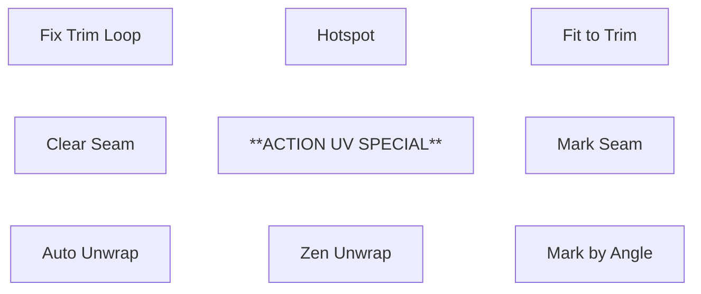

# 🍑 Curves
---
These menus are unique to the **Curve Edit Mode**.
## 🍰 Tool
Keymap: `Shift + RMB Drag`
Additional dependencies: N/A
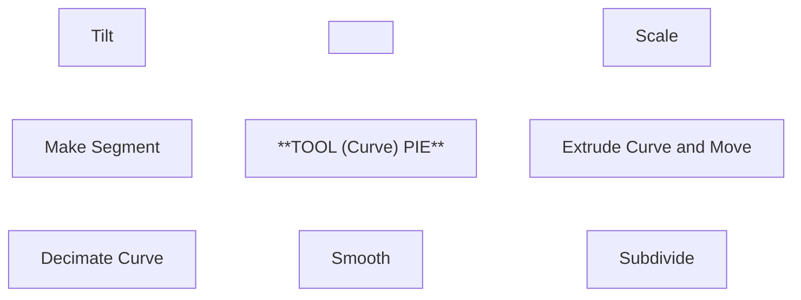

## 🍰 Action
Keymap: `Ctrl + RMB Drag`
Additional dependencies: N/A
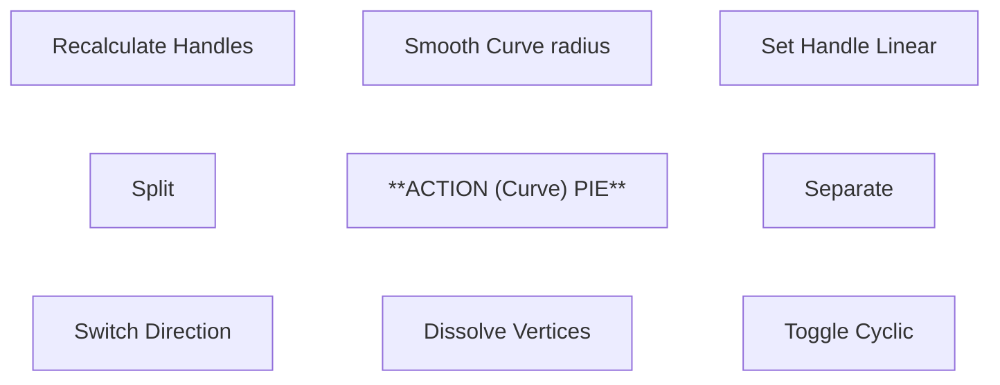

# 🖌️ Sculpt
---
These menus are unique to the **Sculpting** mode. They include all the brushes that come by default with Blender.
## 🍰 General
Keymap: `Shift + RMB Drag`
Additional dependencies: N/A
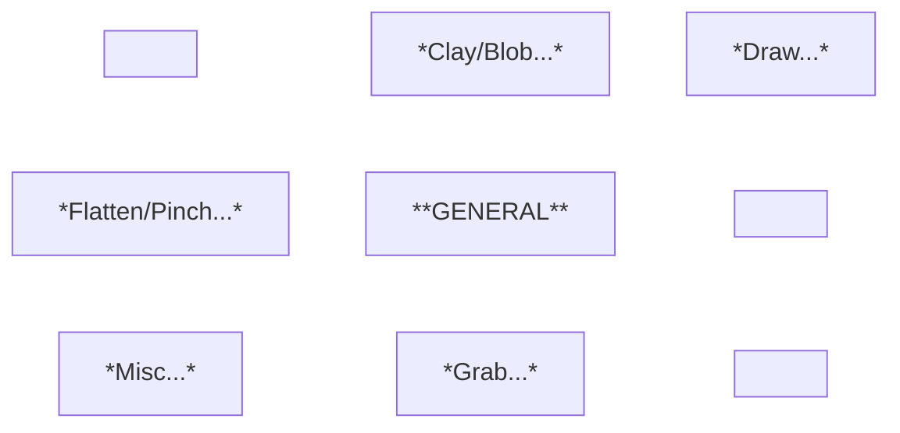
_**Clay/Blob →**_ _Clay, Fill/Deepen, Clay Thumb, Clay Strips, Blob, Layer  
**Draw →** Draw, Draw Sharp_  
_**Grab →**_ _Grab Silhouette, Elastic Snake Hook, Snake Hook, Nudge, Thumb, Grab 2D, Elastic Grab, Grab  
**Misc →**_ _Density, Face Set Paint, Relax Slide, Smear Multires Displacement, Twist, Mask, Relax Pinch, Erase Multires Displacement  
**Flatten/Pinch →**_ _Boundary, Scrape/Fill, Scrape Multiplane, Trim, Smooth, Plateau, Flatten/Contrast, Pinch/Magnify_

## 🍰 Paint
Keymap: `Ctrl + RMB Drag`
Additional dependencies: N/A
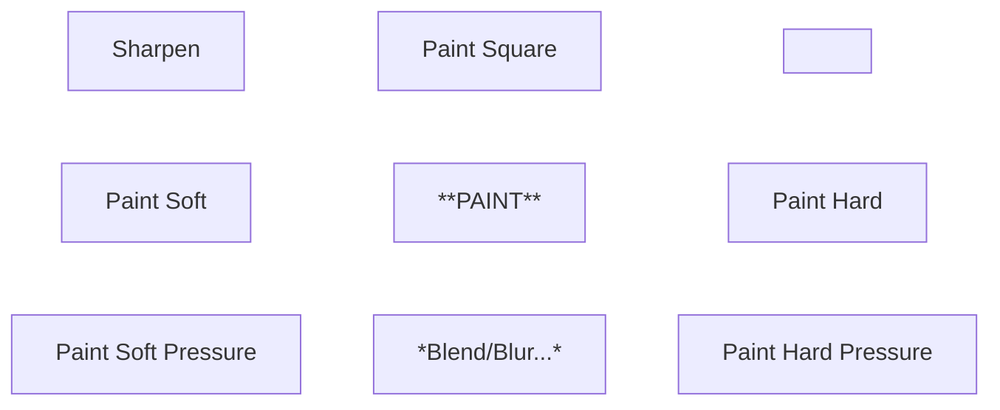
_**Blend/Blur** **→**_ _Paint Blend, Blend Square, Blend Hard, Blend Soft, Smear, Airbrush_

## 🍰 Simulation
Keymap: `Ctrl+ Alt + Shift + RMB Drag`
Additional dependencies: N/A
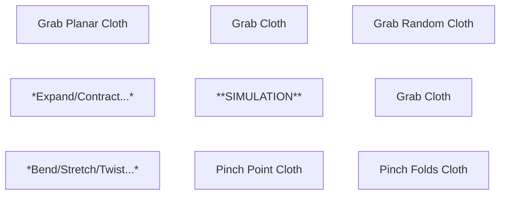
_**Bend/Stretch/Twist →**_ _Twist Boundary Cloth, Bend/Twist Cloth, Stretch/Move Cloth, Bend Boundary Cloth  
**Expand/Contract →**_ _Inflate Cloth, Push Cloth, Expand/Contract Cloth_

# 🗾 UV Editor
---
These menus are unique to the **UV Editor** 2D View.
## 🍰 Tool
Keymap: `Shift + RMB Drag`
Additional dependencies: [ZenUV](https://superhivemarket.com/products/zen-uv)
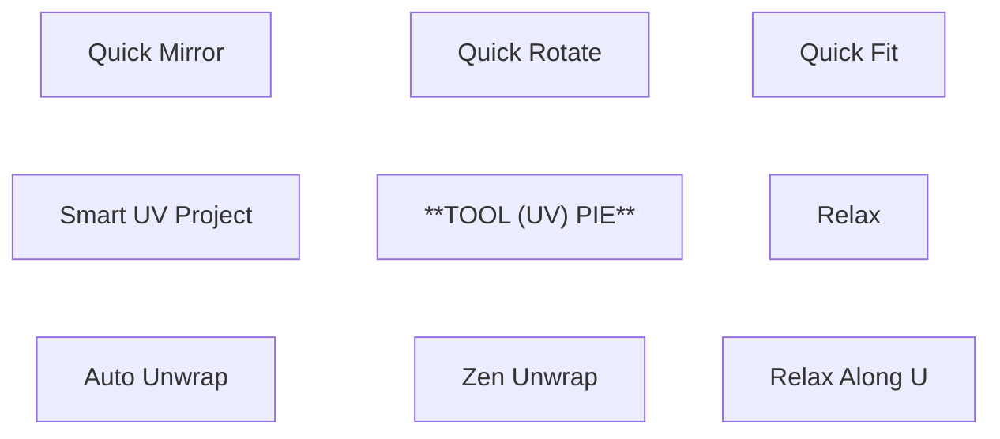

## 🍰 Action
Keymap: `Ctrl + RMB Drag`
Dependencies: [ZenUV](https://superhivemarket.com/products/zen-uv)
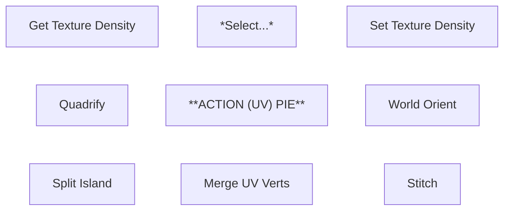
_**Select →**_ _Select Interseam Loop, Select Seams Edges, Select Flipped Islands, Select Overlapped Islands, Select Similar Islands, Select Split Edges, Select Stretched Faces, Select UV Borders_

## 🍰 Action (Special)
Keymap: `Ctrl + Alt + Shift + RMB Drag`
Dependencies: [ZenUV](https://superhivemarket.com/products/zen-uv)
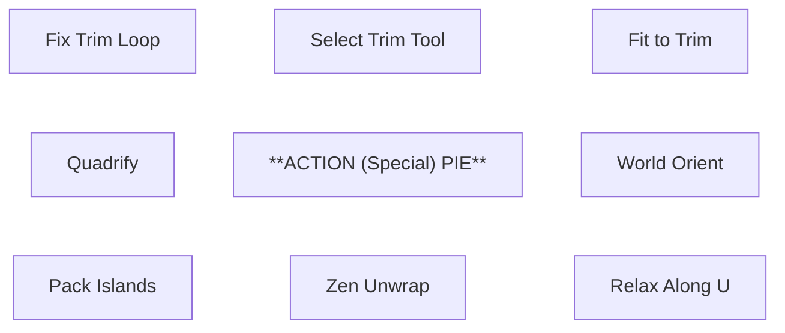

## 🍰 Cursor
Keymap: `Ctrl + Shift + RMB Drag`
Dependencies: N/A
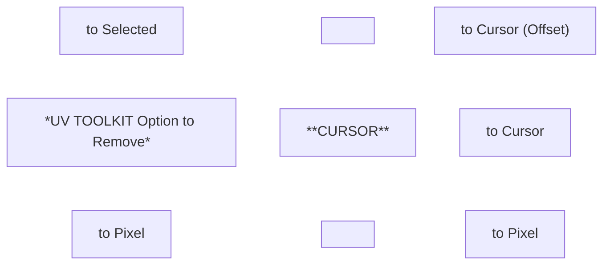

# 💾 File Management
---
## 🍰 Directories
Keymap: `F3`
Dependencies: N/A
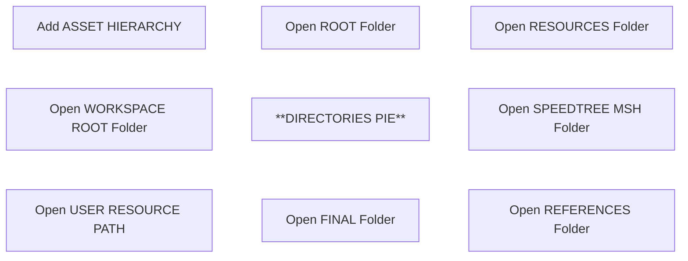

## 🍰 Import / Export
Context: This menu functions in **Object Mode only**.
Keymap: `Ctrl + Alt + Shift + RMB Click`
Dependencies: N/A
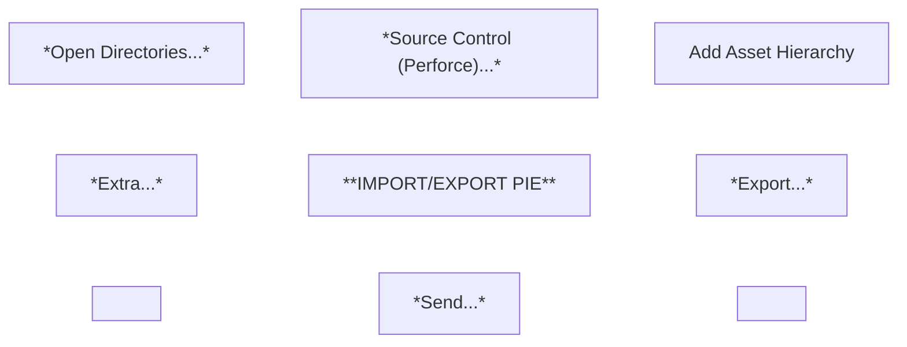

# 🙋‍♂️ Help
---
Keymap: `F1`
Dependencies: N/A
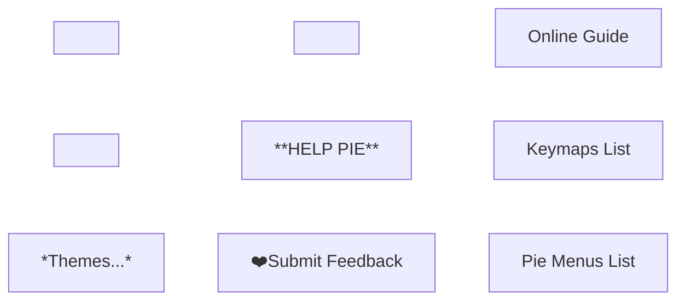
