```mermaid
graph TD

    %% Nodes
    NW[" "]
    W[" "]
    SW["*Themes...*"]

    N[" "]
    C["**HELP PIE**"]
    S["❤️Submit Feedback"]

    NE["Online Guide"]
    E["Keymaps List"]
    SE["Pie Menus List"]

    %% Fake links for positioning
    NW --- W --- SW
    N --- C --- S
    NE --- E --- SE

    %% Hide all connectors AND arrowheads
    linkStyle default stroke:transparent,stroke-width:0;
```

Here is the list of Pie Menus for Blue Hole.

> [!NOTE] Dependencies
> **Note that the Deluxe edition of Blue Hole is required for any Pie Menu shown here.**
> Added dependencies are noted (whenever applicable). The menu would still popup but some option(s) may be missing, with shown warnings.

# 📖 TABLE OF CONTENTS
---
Feel free to use this Table of Contents. You can also search this page for any keyword such as `extrude` to find its pie menu quickly.
- [🧊 OBJECT MODE](#-object-mode)
- [🛠️ MESH EDIT MODE](#-mesh-edit-mode)
- [🍑 CURVES](#-curves)
- [🖌️ SCULPT](#-sculpt)
- [🗾 UV EDITOR](#-uv-editor)
- [💾 FILE MANAGEMENT](#-file-management)
- [🙋‍♂️ HELP](#-help)
- [🥧 PIE MENU LIST (WITH KEYMAPS)](#-pie-menu-list-with-keymaps)
- [🥷 USING THE PIE MENUS WITHOUT DELUXE](#-using-the-pie-menus-without-deluxe)

# 🧊 **OBJECT MODE**
---
These menus are unique to **Object Mode**.
## 🍰 Tool
Keymap: `Shift + RMB Drag`
Additional dependencies: [HardOPS](https://superhivemarket.com/products/hard-ops--boxcutter-ultimate-bundle).
Internal name: `BLUEHOLE_MT_pie_object_tool`

_**Modifier Options** → Link/Transfer Data, Apply Modifiers_

## 🍰 Action
Keymap: `Ctrl + RMB Drag`
Additional dependencies: N/A
Internal Name: `BLUEHOLE_MT_pie_object_action`

_**Select** → Select Grouped, Select Parent, Invert, Select Children  
**More** → Convert to Mesh, Apply Modifiers, Make Instances Real, Clean, Convert to Curve_

# 🛠️ **MESH EDIT MODE**
---
These menus are unique to **Mesh Edit Mode**, which corresponds to **Vertex**, **Edge** and **Face** selection.
## 🍰 Tool
Keymap: `Shift + RMB Drag`
Additional dependencies: N/A
Internal Name: `BLUEHOLE_MT_pie_mesh_tool`

## 🍰 Action (Vertex)
Context: **Vertex Edit Mode**
Keymap: `Ctrl + RMB Drag`
Additional dependencies: N/A
Internal Name: `BLUEHOLE_MT_pie_mesh_action`

_**Select →**_ _Random, Invert, Loose Geometry_  
_**More →**_ _To Sphere, Symmetrize, Quick Flatten, Vertex to Circle, Quick Lattice_

## 🍰 Action (Edge)
Context: **Edge Edit Mode**
Keymap: `Ctrl + RMB Drag`
Additional dependencies: N/A
Internal Name: `BLUEHOLE_MT_pie_mesh_action`

_**Select →**_ _Smart Loop, Sharp Edges, Invert, Smart Ring, Loop Inner-Region_  
_**More →**_ _Subdivide Edge-Ring, Rotate Selected Edge (Right), Quick Pipe, Rotate Selected Edge (Left), Mesh Angle, Collapse_

## 🍰 Action (Face)
Context: **Face Edit Mode**
Keymap: `Ctrl + RMB Drag`
Additional dependencies: N/A
Internal Name: `BLUEHOLE_MT_pie_mesh_action`

_**Select →**_ _Boundary Loop, Linked Flat Faces, Invert, Loose Geometry, Random_  
_**More →**_ _Poke Face, Recalculate Normals Inside, Recalculate Normals Outside, Subdivide, Tris to Quads, Flip, Triangulate Faces, Un-Subdivide_

## 🍰 Action UV Special (Vertex, Edge, Face)
*This menu has **UV-related** options. It is available from all three **Vertex**, **Edge** and **Face** modes.*
Keymap: `Ctrl + Alt + Shift + RMB Drag`
Additional dependencies: [ZenUV](https://superhivemarket.com/products/zen-uv), [DreamUV](https://github.com/leukbaars/DreamUV)
Additional dependencies: N/A
Internal Name: `BLUEHOLE_MT_pie_mesh_action_uvspecial`

# 🍑 **CURVES**
---
These menus are unique to the **Curve Edit Mode**.
## 🍰 Tool
Keymap: `Shift + RMB Drag`
Additional dependencies: N/A
Internal Name: `BLUEHOLE_MT_pie_curve_tool`

## 🍰 Action
Keymap: `Ctrl + RMB Drag`
Additional dependencies: N/A
Internal Name: `BLUEHOLE_MT_pie_curve_action`

# 🖌️ **SCULPT**
---
These menus are unique to the **Sculpting** mode. They include all the brushes that come by default with Blender.
## 🍰 General
Keymap: `Shift + RMB Drag`
Additional dependencies: N/A
Internal Name: `BLUEHOLE_MT_pie_sculpt_tool`

_**Clay/Blob →**_ _Clay, Fill/Deepen, Clay Thumb, Clay Strips, Blob, Layer  
**Draw →** Draw, Draw Sharp_  
_**Grab →**_ _Grab Silhouette, Elastic Snake Hook, Snake Hook, Nudge, Thumb, Grab 2D, Elastic Grab, Grab  
**Misc →**_ _Density, Face Set Paint, Relax Slide, Smear Multires Displacement, Twist, Mask, Relax Pinch, Erase Multires Displacement  
**Flatten/Pinch →**_ _Boundary, Scrape/Fill, Scrape Multiplane, Trim, Smooth, Plateau, Flatten/Contrast, Pinch/Magnify_

## 🍰 Paint
Keymap: `Ctrl + RMB Drag`
Additional dependencies: N/A
Internal Name: `BLUEHOLE_MT_pie_sculpt_action`

_**Blend/Blur** **→**_ _Paint Blend, Blend Square, Blend Hard, Blend Soft, Smear, Airbrush_

## 🍰 Simulation
Keymap: `Ctrl+ Alt + Shift + RMB Drag`
Additional dependencies: N/A
Internal Name: `BLUEHOLE_MT_pie_sculpt_simulation`

_**Bend/Stretch/Twist →**_ _Twist Boundary Cloth, Bend/Twist Cloth, Stretch/Move Cloth, Bend Boundary Cloth  
**Expand/Contract →**_ _Inflate Cloth, Push Cloth, Expand/Contract Cloth_

# 🗾 **UV EDITOR**
---
These menus are unique to the **UV Editor** 2D View.
## 🍰 Tool
Keymap: `Shift + RMB Drag`
Additional dependencies: [ZenUV](https://superhivemarket.com/products/zen-uv)
Internal Name: `BLUEHOLE_MT_pie_UV_tool`

## 🍰 Action
Keymap: `Ctrl + RMB Drag`
Dependencies: [ZenUV](https://superhivemarket.com/products/zen-uv)
Internal Name: `BLUEHOLE_MT_pie_UV_action`

_**Select →**_ _Select Interseam Loop, Select Seams Edges, Select Flipped Islands, Select Overlapped Islands, Select Similar Islands, Select Split Edges, Select Stretched Faces, Select UV Borders_

## 🍰 Action (Special)
Keymap: `Ctrl + Alt + Shift + RMB Drag`
Dependencies: [ZenUV](https://superhivemarket.com/products/zen-uv)
Internal Name: `BLUEHOLE_MT_pie_UV_action_uvspecial`

## 🍰 Cursor
Keymap: `Ctrl + Shift + RMB Drag`
Dependencies: N/A
Internal Name: `BLUEHOLE_MT_pie_UV_cursor`

# 💾 **FILE MANAGEMENT**
---
## 🍰 Directories
Keymap: `F3`
Dependencies: N/A
Internal Name: `BLUEHOLE_MT_pie_global_dirs`

## 🍰 Import / Export
Context: This menu functions in **Object Mode only**.
Keymap: `Ctrl + Alt + Shift + RMB Click`
Dependencies: N/A
Internal Name: `BLUEHOLE_MT_pie_global_import_export`

# 🙋‍♂️ **HELP**
---
Keymap: `F1`
Dependencies: N/A

# 🥧 **PIE MENU LIST (WITH KEYMAPS)**
---
Here is a list of the pie menus available to you, as well as some important information:
- Name: Name of the Pie Menu
- Context: Where in Blender can it be triggered/enabled
- Keymap: Which hotkey to press to trigger it
- Origin: From where does it come from
- Description: What is its purpose?

| **Name**                          | **Context**                             | **Keymap**                                | **Origin**                   | **Description**                                                                                                      |
| --------------------------------- | --------------------------------------- | ----------------------------------------- | ---------------------------- | -------------------------------------------------------------------------------------------------------------------- |
| Shading and Overlays              | 3D Viewport                             | `Z`                                       | ?                            | Pie Menu to switch between View/Rendering styles, Shading and Normal adjustments.                                    |
| Help                              |                                         | `F1`                                      | Blue Hole                    | Pie Menu that links to documentation and offers a way to give feedback.                                              |
| Directories                       |                                         | `F3`                                      | Blue Hole                    | Quickly navigate to commonly used directories.                                                                       |
| Import/Export                     | 3D Viewport (Object Mode only)          | `Ctrl + Alt + Shift + RMB`                | Blue Hole                    | Pie Menu with quick import-export options.                                                                           |
| Tools                             | Many                                    | `Shift + RMB Drag`                        | Blue Hole                    | Offers many helpful tools in various contexts such as: Object Mode, Verts/Edge/Face Mode, Curve, Sculpt & UV Mode.   |
| Action                            | Many                                    | `Ctrl + RMB Drag`                         | Blue                         | Offers many helpful actions in various contexts such as: Object Mode, Verts/Edge/Face Mode, Curve, Sculpt & UV Mode. |
| Action (UV Special)               | 3D Viewport (Mesh Mode only), UV Editor | `Ctrl + Alt + Shift + RMB Drag`           | Blue Hole                    | Offers helpful options related to UV unwrapping: mark seam, clear seam, unwrap, etc.                                 |
| Cursor and Origin                 | 3D Viewport, UV Editor                  | `Ctrl + Shift + RMB`                      | Blender & Blue Hole (Hybrid) | Cursor and Origin Options (Menu in 3D Viewport comes with Blender; Menu in UV Editor comes from Blue Hole).          |
| Transform: Pivot and Orientations | 3D Viewport                             | `Shift + Alt + RMB`                       | ?                            | Set the Orientation target or the Pivot Method, with multiple Presets or set New Custom Orientation.                 |
| Snapping Pie                      | 3D Viewport                             | `Ctrl + Alt + RMB`                        | ?                            | Quick snapping presets for every modes.                                                                              |
| Quick Align Pie                   | 3D Viewport (Mesh Mode only)            | `Alt + W`                                 | ?                            | Quick Align Functionalities for Object, Mesh and UV.                                                                 |
| Mode                              | Many                                    | `RMB Drag`                                | Blender                      | Switch Between any Mode: Object/Vertex/Edge/Face/Curve/Sculpt/UV/Paint/etc.                                          |
| Save, Open, Append                | 3D Viewport                             | `Alt + Shift + S`                         |                              | Save, Open, Append to Scene Pie                                                                                      |
| Create                            | 3D Viewport                             | `Shift + A + Drag Mouse in Any Direction` | Blue Hole                    | Create new shapes, curves, etc.                                                                                      |
| Hide                              | 3D Viewport                             | `Shift + S + Drag Mouse in Any Direction` | Blue Hole                    | Hide Selection, Isolate Selection, Reveal Hidden (All)                                                               |
| Collection                        | 3D Viewport                             | `C + Drag Mouse in Any Direction`         | Blender                      | Pie Menu for Collections                                                                                             |

# 🥷 **USING THE PIE MENUS WITHOUT DELUXE**
---
If you want to use the pie menus whilst using Blue Hole Regular (non-deluxe), you can bind keymaps to the menus by yourself.
1. Navigate to `Blender Settings`
2. Navigate to the `Keymap` Tab
3. Find the proper context for the pie menu (eg. UV Editor)
4. Add a new keymap entry
5. Just make sure to use the `wm.open_menu_pie` operator and use the `Internal Name` specified under each Pie Menu in this document as name of the pie menu.